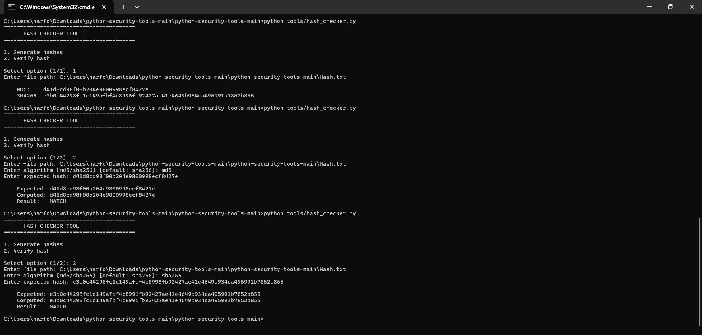
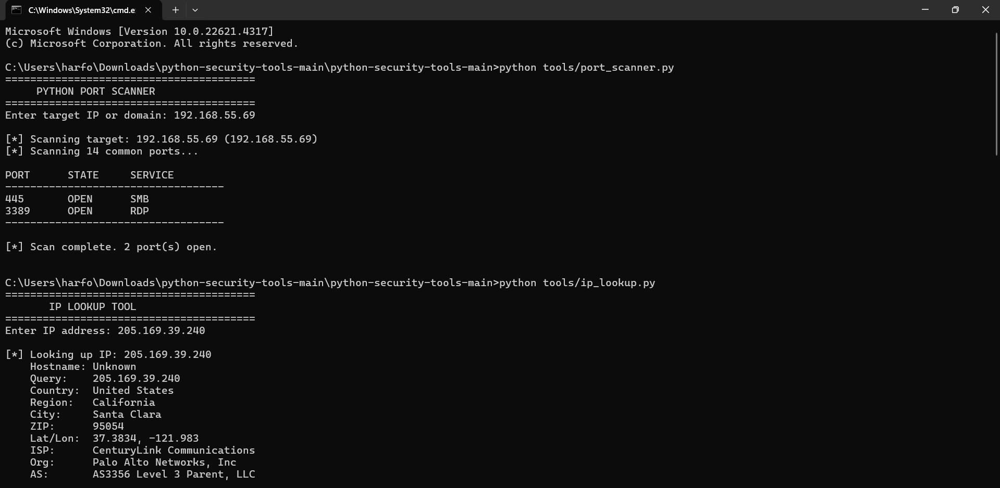
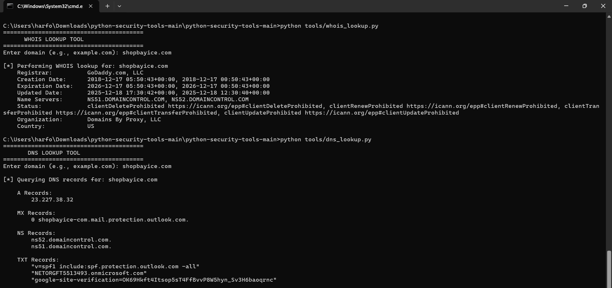

# Python Security Tools

A collection of beginner-friendly, professional Python-based cybersecurity and networking utilities focused on automation, reconnaissance, and security analysis.

Built with Python for learning, experimentation, and practical security workflow automation.

---

# Preview

## Hash Checker Tool

---

## Port Scanner & IP Lookup

---

## WHOIS Lookup & DNS Lookup Tool

---

# Features

- Python-based CLI utilities
- Networking tools
- Socket programming
- DNS lookups
- WHOIS lookups
- IP intelligence gathering
- Hash generation & verification
- Security workflow automation
- Beginner-friendly cybersecurity tooling
- Lightweight modular architecture

---

# Tools Included

| Tool | Description |
|------|-------------|
| `port_scanner.py` | Scan IP addresses or domains for open common ports using raw sockets. |
| `ip_lookup.py` | Retrieve geolocation and network information for an IP address. |
| `whois_lookup.py` | Perform WHOIS lookups on domains. |
| `dns_lookup.py` | Query DNS records (A, MX, NS, TXT) for a domain. |
| `hash_checker.py` | Generate and verify file hashes using MD5 and SHA-256. |

---

# Project Structure

python-security-tools/
│
├── tools/
│   ├── port_scanner.py
│   ├── ip_lookup.py
│   ├── whois_lookup.py
│   ├── dns_lookup.py
│   └── hash_checker.py
│
├── screenshots/
│   ├── hash-checker-tool.png
│   ├── port-scanner-and-ip-lookup.png
│   └── whois-lookup-tool-and-dns-lookup-tool.png
│
├── requirements.txt
├── README.md
└── LICENSE



# Installation
1. Clone the Repository
git clone https://github.com/Quiford/python-security-tools.git
cd python-security-tools





2. Install Dependencies
pip install -r requirements.txt
or
py -m pip install -r requirements.txt





# Usage
All tools are CLI-based and can be run directly from the terminal.





# Port Scanner
python tools/port_scanner.py


⸻


## IP Lookup
python tools/ip_lookup.py





## WHOIS Lookup
python tools/whois_lookup.py





## DNS Lookup
python tools/dns_lookup.py





## Hash Checker
python tools/hash_checker.py





# Requirements
* Python 3.8+
* See requirements.txt for required dependencies





# Roadmap
Planned additions:
* Multi-threaded port scanning
* Subdomain enumeration
* URL reputation checker
* Packet analysis utilities
* Improved CLI argument handling
* Async networking support
* Expanded automation workflows





# Learning Goals
This repository was created to practice and demonstrate:
* Python scripting
* Networking fundamentals
* Cybersecurity tooling concepts
* API integrations
* Socket programming
* CLI application development
* Project organization and documentation





# Disclaimer
These tools are intended for educational purposes and authorized security testing only.
Always obtain proper permission before scanning or analyzing networks and systems you do not own.





# License
This project is licensed under the MIT License.
See LICENSE for details.




# Author
Afolabi Yusuf Oladipupo
GitHub:
https://github.com/Quiford